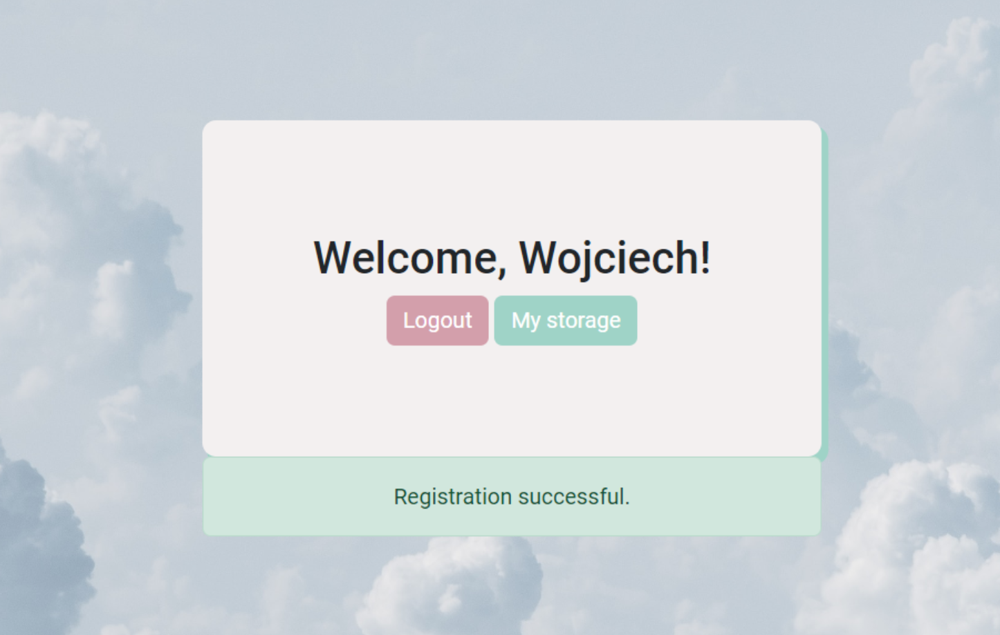
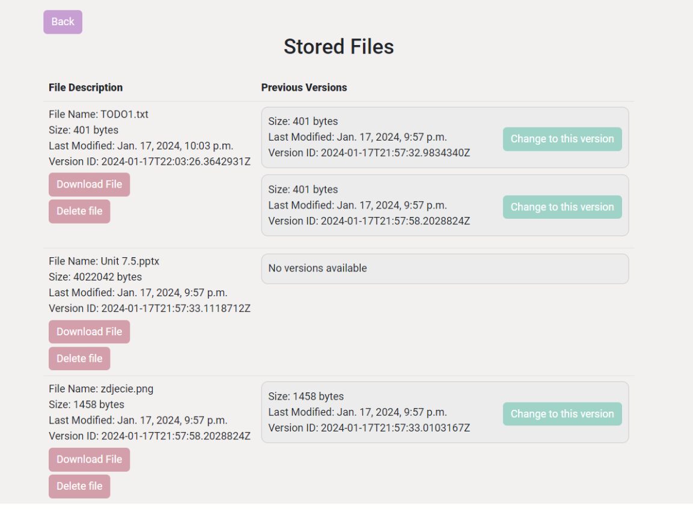

<h1 align="center" id="title">Cloud Storage Web Application</h1>

This is a cloud storage website built with Django and Python (planning to add frontend in React). Made for the Cloud Computing Systems course at TUL. To enter the website, just open the link: <a href="https://cloudappdjango.azurewebsites.net/">Cloud Storage Website</a>
    

<h2>🧐 Features</h2>

Here're some of the project's best features:

* Register, login, and logout functionality using Django's built-in user authentication
* Uploading, downloading, and deleting files
* Custom blob_handler for managing file storage
* User activity log tracking file uploads, downloads, and deletions
* Configured to handle CORS, allowing the app to safely and securely handle requests from different origins
* Responsive and minimalistic UI built with HTML, CSS, and JavaScript (using jQuery and Select2 for enhanced user experience)

<h2>💻 Built with</h2>

Technologies used in the project:

* Django
* Python
* PostresSQL
* jQuery & Select2
* Microsoft Azure
* React (frontend - SOON)
